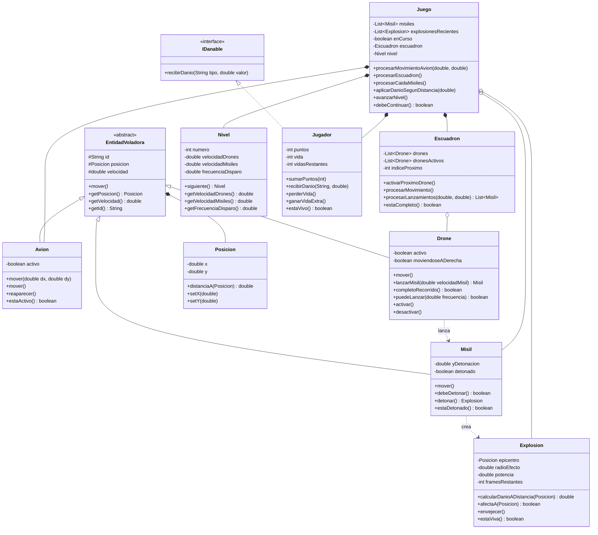

# Sky Defense — Diagrama de Clases

## Notas de diseño

- **`EntidadVoladora`** (abstracta) — generaliza el estado y comportamiento de
  todo lo que se desplaza por el espacio aereo: `Avion`, `Drone` y `Misil`.
  Aporta `posicion`, `velocidad`, `id` y el metodo abstracto `mover()`.
- **`IDanable`** (interfaz) — contrato "puede recibir dano". Implementado por
  `Jugador`. Permite aplicar dano sin acoplar a la clase concreta.
- **`Misil`** — concreto. Lo lanza un dron, desciende en linea recta y detona a
  una altitud aleatoria. El jugador **no dispara**: solo esquiva (segun consigna).

### Principios aplicados
- **Herencia** — `EntidadVoladora` como base de avion, dron y misil.
- **Polimorfismo** — `mover()` se redefine en cada entidad.
- **SRP** — `Jugador` (puntos/vida), `Avion` (posicion), `Juego` (orquestacion) separados.
