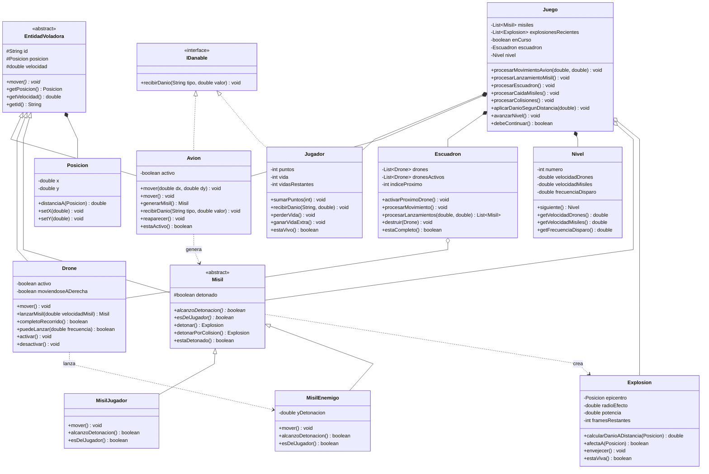

# Sky Defense — Diagrama de Clases

## Notas de diseño

- **`EntidadVoladora`** (abstracta) — generaliza el estado y comportamiento comun
  de todo lo que se desplaza por el espacio aereo: `Avion`, `Drone` y `Misil`.
  Aporta `posicion`, `velocidad`, `id` y el metodo abstracto `mover()`.
- **`IDanable`** (interfaz) — contrato de "puede recibir dano". Implementado por
  `Avion` y `Jugador`, permitiendo aplicar dano sin conocer la clase concreta.
- **`Misil`** (abstracta) → `MisilJugador` (asciende, solo explota por colision)
  y `MisilEnemigo` (desciende, detona a una altitud aleatoria). Polimorfismo:
  `Juego` opera sobre `Misil` sin ramas `if`.

### Principios aplicados
- **Herencia** — `EntidadVoladora` y `Misil` como bases.
- **Polimorfismo (LSP)** — subtipos de `Misil` sustituibles donde se espera `Misil`.
- **OCP** — agregar un nuevo tipo de misil o entidad = nueva subclase, sin tocar `Juego`.
