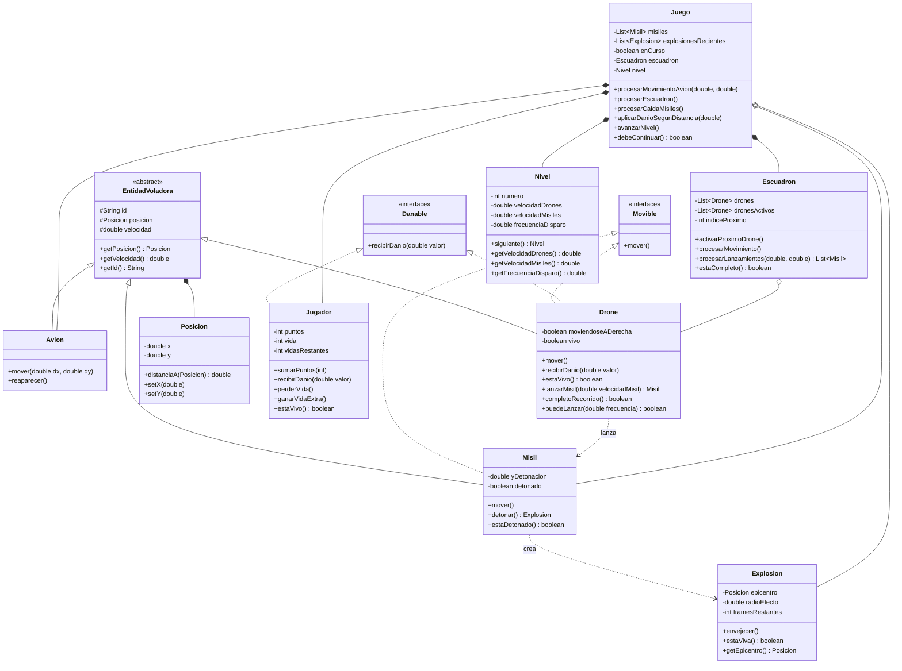

# Sky Defense — Diagrama de Clases

## Notas de diseño

- **`EntidadVoladora`** (clase abstracta) — comparte el **estado** comun de toda
  entidad del espacio aereo: `Avion`, `Drone`, `Misil`. Aporta `posicion`,
  `velocidad`, `id`. No se puede instanciar.
- **`Movible`** (interface) — contrato de **comportamiento** "se desplaza solo
  cada tick". Lo implementan `Drone` (cruza horizontal) y `Misil` (desciende).
  El `Avion` **no** lo implementa: se mueve por input del jugador, con otra firma.
- **`Misil`** — concreto. Lo lanza un dron, cae en linea recta y detona a una
  altitud aleatoria. El jugador no dispara: solo esquiva (segun consigna).

### Distincion clase abstracta vs interface (Clase 10)
- **Clase abstracta** (`EntidadVoladora`) — cuando se comparte **estado/codigo**
  entre clases estrechamente relacionadas.
- **Interface** (`Movible`) — cuando se especifica un **comportamiento** que
  pueden cumplir distintas clases, sin compartir implementacion.
