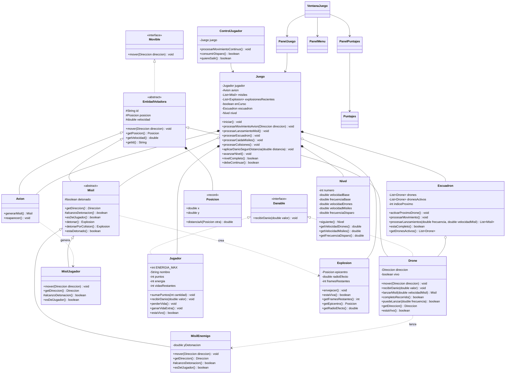

# Sky Defense — Diagrama de Clases

```mermaid
classDiagram
    direction TB

    class Movible {
        <<interface>>
        +mover(Direccion direccion) void
    }

    class Danable {
        <<interface>>
        +recibirDanio(double valor) void
    }

    class EntidadVoladora {
        <<abstract>>
        #String id
        #Posicion posicion
        #double velocidad
        +mover(Direccion direccion) void
        +getPosicion() Posicion
        +getVelocidad() double
        +getId() String
    }

    class Avion {
        +generarMisil() Misil
        +reaparecer() void
    }

    class Drone {
        -Direccion direccion
        -boolean vivo
        +mover(Direccion direccion) void
        +recibirDanio(double valor) void
        +lanzarMisil(double velocidadMisil) Misil
        +completoRecorrido() boolean
        +puedeLanzar(double frecuencia) boolean
        +getDireccion() Direccion
        +estaVivo() boolean
    }

    class Misil {
        <<abstract>>
        #boolean detonado
        +getDireccion()* Direccion
        #alcanzoDetonacion()* boolean
        +esDelJugador()* boolean
        +detonar() Explosion
        +detonarPorColision() Explosion
        +estaDetonado() boolean
    }

    class MisilJugador {
        +mover(Direccion direccion) void
        +getDireccion() Direccion
        #alcanzoDetonacion() boolean
        +esDelJugador() boolean
    }

    class MisilEnemigo {
        -double yDetonacion
        +mover(Direccion direccion) void
        +getDireccion() Direccion
        #alcanzoDetonacion() boolean
        +esDelJugador() boolean
    }

    class Jugador {
        +int ENERGIA_MAX
        -String nombre
        -int puntos
        -int energia
        -int vidasRestantes
        +sumarPuntos(int cantidad) void
        +recibirDanio(double valor) void
        +perderVida() void
        +ganarVidaExtra() void
        +estaVivo() boolean
    }

    class Explosion {
        -Posicion epicentro
        -double radioEfecto
        -int framesRestantes
        +envejecer() void
        +estaViva() boolean
        +getFramesRestantes() int
        +getEpicentro() Posicion
        +getRadioEfecto() double
    }

    class Posicion {
        <<record>>
        +double x
        +double y
        +distanciaA(Posicion otra) double
    }

    class Escuadron {
        -List~Drone~ drones
        -List~Drone~ dronesActivos
        -int indiceProximo
        +activarProximoDrone() void
        +procesarMovimiento() void
        +procesarLanzamientos(double frecuencia, double velocidadMisil) List~Misil~
        +estaCompleto() boolean
        +getDronesActivos() List~Drone~
    }

    class Nivel {
        -int numero
        -double velocidadBase
        -double frecuenciaBase
        -double velocidadDrones
        -double velocidadMisiles
        -double frecuenciaDisparo
        +siguiente() Nivel
        +getVelocidadDrones() double
        +getVelocidadMisiles() double
        +getFrecuenciaDisparo() double
    }

    class Juego {
        -Jugador jugador
        -Avion avion
        -List~Misil~ misiles
        -List~Explosion~ explosionesRecientes
        -boolean enCurso
        -Escuadron escuadron
        -Nivel nivel
        +iniciar() void
        +procesarMovimientoAvion(Direccion direccion) void
        +procesarLanzamientoMisil() void
        +procesarEscuadron() void
        +procesarCaidaMisiles() void
        +procesarColisiones() void
        +aplicarDanioSegunDistancia(double distancia) void
        +avanzarNivel() void
        +nivelCompleto() boolean
        +debeContinuar() boolean
    }

    class ControlJugador {
        -Juego juego
        +procesarMovimientoContinuo() void
        +consumirDisparo() boolean
        +quiereSalir() boolean
    }

    class VentanaJuego
    class PanelJuego
    class PanelMenu
    class PanelPuntajes
    class Puntajes

    Movible <|.. EntidadVoladora
    EntidadVoladora <|-- Avion
    EntidadVoladora <|-- Drone
    EntidadVoladora <|-- Misil
    Danable <|.. Drone
    Danable <|.. Jugador

    Misil <|-- MisilJugador
    Misil <|-- MisilEnemigo

    EntidadVoladora *-- Posicion
    Avion ..> MisilJugador : genera
    Drone ..> MisilEnemigo : lanza
    Misil ..> Explosion : crea

    Escuadron o-- Drone
    Juego *-- Jugador
    Juego *-- Avion
    Juego *-- Escuadron
    Juego *-- Nivel
    Juego o-- Misil
    Juego o-- Explosion

    ControlJugador --> Juego
    PanelJuego --> Juego
    VentanaJuego --> PanelMenu
    VentanaJuego --> PanelJuego
    VentanaJuego --> PanelPuntajes
    PanelPuntajes --> Puntajes
```

## Decisiones de diseño

- `EntidadVoladora` centraliza el estado común (`id`, `posición`, `velocidad`) de avión, drones y misiles.
- `Movible` define el contrato de movimiento; las subclases restringen las direcciones cuando corresponde.
- `Misil` abstrae el comportamiento común de los proyectiles y permite tratar de forma polimórfica a `MisilJugador` y `MisilEnemigo`.
- `Danable` desacopla la recepción de daño de una clase concreta y es implementada por `Jugador` y `Drone`.
- `Posicion` se modela como `record`, manteniendo coordenadas inmutables dentro de los límites del área de juego.
- `Juego` actúa como coordinador principal de la lógica de dominio: movimiento, colisiones, daño, niveles y estado de la partida.
